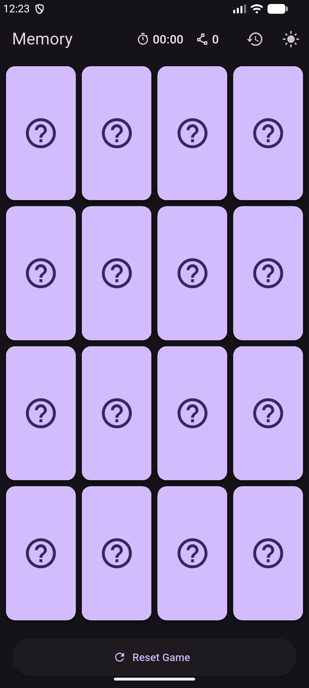
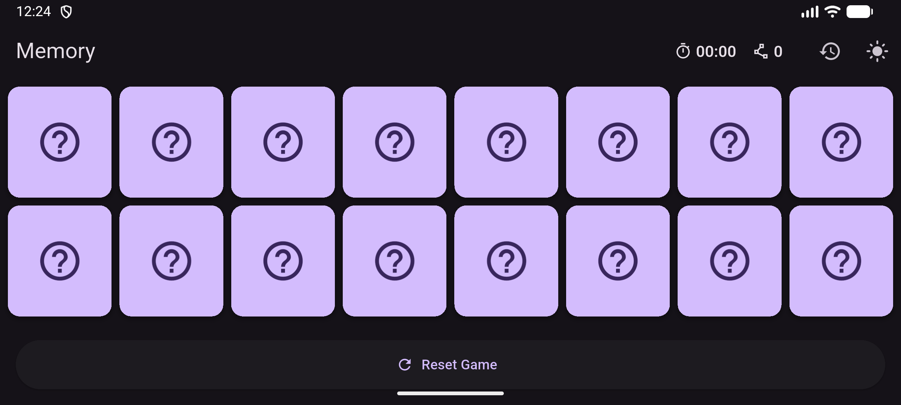
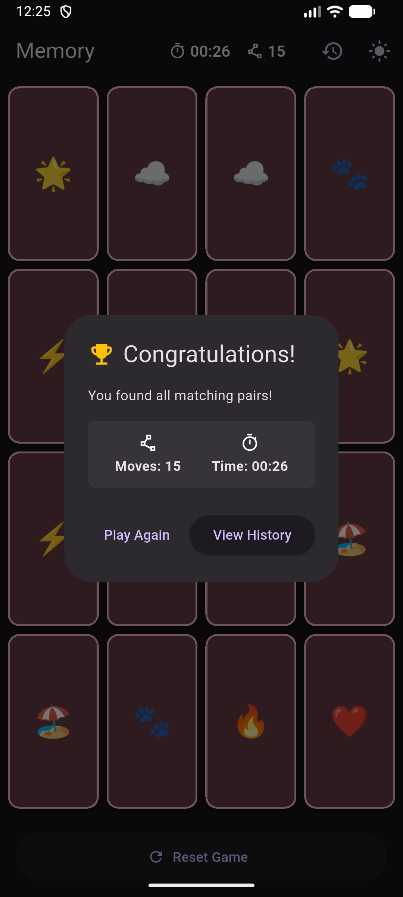
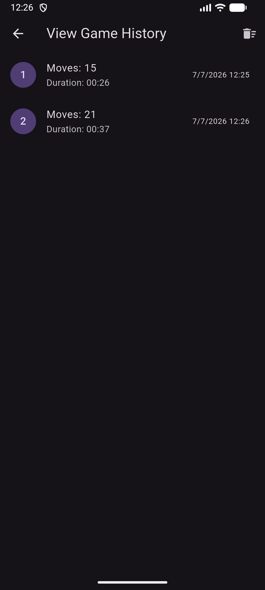

# Weekend Memory

## Overview

**Weekend Memory** is a production-quality Flutter showcase demonstrating how to build a complete game without relying on external game engines.

The project focuses on modern Flutter engineering practices, including **Riverpod 3.x**, **Clean Architecture**, **Local-First persistence with Isar**, responsive layouts, widget testing, and golden testing.

Originally developed as a weekend challenge, the project evolved into a technical reference for AI-assisted Flutter development using **Aider** together with the **Qwen** language model.

## Screenshots

### Gameplay & Adaptive Layout

| Portrait Mode | Landscape Mode |
| :---: | :---: |
|  |  |

### Game Completion & Persistence (Local-First)

| Success Dialog | Game History |
| :---: | :---: |
|  |  |

## Features

- Animated card flipping with custom flip transitions
- Responsive portrait & landscape layouts
- Local-First persistence (Isar Database) with leaderboard sorting
- Reactive state management with Riverpod 3.x
- Material 3 design with full Light & Dark theme support
- Adaptive layout columns based on device orientation
- Multiple game modes (Classic timer & Countdown)
- Production-grade test suite (Unit, Widget, and Golden tests)

## Core Technologies

- Flutter & Dart
- Riverpod 3.x (Code Generation)
- Isar Database (Community Edition)
- Flutter Localizations (intl i18n)

## Architecture

The project follows a strict **Feature-First, Clean Architecture** approach coupled with a **Local-First** data strategy.

```text
lib/
├── core/
│   └── theme/
├── features/
│   └── memory_game/
│       ├── data/          # Isar Repositories implementation & generated adapters
│       ├── domain/        # Pure Dart models & services (MemoryCard, GameResult, GameEngine)
│       └── presentation/  # Riverpod Notifiers & responsive UI layouts
└── l10n/                  # ARB Localization files (EN/PL)
```

### Architecture Blueprint

| Layer | Responsibility | Key Artifacts |
|-------|---------------|---------------|
| **Domain** | Pure Dart business logic with zero Flutter or Riverpod dependencies | `MemoryCard`, `GameResult`, `GameMode`, `GameEngine` |
| **Data** | Isar database entities, repositories, and generated adapters | `GameHistoryRepository`, `GameResult.g.dart` |
| **Presentation** | Riverpod state notifiers, responsive layouts, and component widgets | `MemoryGameProvider`, `GameBoard`, `GameHistoryCard` |

The domain layer is intentionally framework-agnostic, enabling pure Dart unit testing and straightforward reuse across platforms. The data layer bridges Isar's reactive streams to the domain via repository interfaces. The presentation layer consumes domain state through Riverpod providers and renders responsive Material 3 UI.

## Why no Game Engine?

The goal of the project was to demonstrate that Flutter's native widget system and animation framework are more than sufficient for implementing lightweight 2D game mechanics. Instead of adding overhead with heavy game engines like Flame, the project intentionally uses standard Flutter layout primitives, custom explicit animations, and reactive state management.


## Key Technical Challenges & Solutions

### Nullable State Mutations
Resetting nullable fields in immutable state (e.g., `firstSelectedCardIndex` to `null`) can cause unintended state leaking in Riverpod if not handled correctly. This was resolved using the **Sentinel Value pattern**. The `copyWith` method uses a private `Object` constant (`_unset`) to distinguish between "no change" and "set to null".
```dart
// Inside MemoryGameState
static const _unset = Object();

MemoryGameState copyWith({
  Object? firstSelectedCardIndex = _unset,
  // ...
}) {
  return MemoryGameState(
    firstSelectedCardIndex: firstSelectedCardIndex == _unset 
        ? this.firstSelectedCardIndex 
        : firstSelectedCardIndex as int?,
    // ...
  );
}
```

### Reactivity in Unit Tests
Testing asynchronous event loops in Riverpod 3.x requires careful handling of microtasks. Using `fakeAsync` from `package:test` is essential. Crucially, you must force an active container subscription (`container.listen`) to ensure the Riverpod provider is instantiated and microtasks flush state changes synchronously during the test.
```dart
// Example test setup
await container.listen(provider, (previous, next) {});
await tester.pump();
```

### Efficient Widget Rebuilds

The UI minimizes unnecessary rebuilds by leveraging Riverpod's `select()` API. Each card rebuilds independently, allowing animations and state updates to remain highly performant even when the board grows larger.
```dart
ref.watch(
memoryGameProvider.select((state) => state.cards[index]),
);
```

### Adaptive Layout

The game board automatically adapts to the available screen space. The layout dynamically adjusts both the number of columns and the card aspect ratio using `LayoutBuilder`.

| Orientation | Grid Layout | Cross Axis Count |
|--------------|-------------|-----------------|
| Portrait | 4 × 4       | 4 columns       |
| Landscape | 8 × 2       | 8 columns       |


## New Feature Infrastructure

### Game Mode Support

The project now supports two distinct game modes defined by the `GameMode` enum:

| Mode | Behavior |
|------|----------|
| `classic` | Standard timer that counts up from zero |
| `countdown` | Reverse timer that counts down from a configurable duration |

The `GameEngine` domain service encapsulates all pure game logic (shuffling, matching, win conditions) with zero Flutter or Riverpod dependencies, making it trivially testable and platform-agnostic.

### Game History with Mode-Aware Persistence

Game results now automatically persist the active game mode alongside traditional metrics (move count, duration, grid size). The `GameHistoryCard` widget visually distinguishes modes using context-aware indicators:

- **Stopwatch icon** — Classic mode (counting up)
- **Hourglass icon** — Countdown mode (counting down)

This allows players to quickly identify their previous session type at a glance.


## Quality Assurance & Testing

The codebase includes multiple layers of automated testing protecting against logic bugs, UI misbehavior, and visual regression.

### Verification Standards

| Metric | Target | Current |
|--------|--------|---------|
| Linter warnings (`dart custom_lint`) | 0 | 0 |
| Analyzer errors (`flutter analyze`) | 0 | 0 |
| Active tests | — | 48 |
| Test health | 100% | 100% |

All code changes must pass the full verification pipeline before merging:

```bash
dart run build_runner build --delete-conflicting-outputs
flutter analyze
dart run custom_lint
flutter test
```

### Test Suite Highlights

- **Unit Tests:** Full coverage of the matching algorithm, move counter, input blocking during mismatches, and Isar persistence triggers.

- **Widget Tests:** Explicit structural verification of grid padding, custom spacing, and responsive column constraints.

- **Golden Tests:** Multi-device visual regression verification covering initial state, portrait/landscape grids, card flip states, and the final success dialog.


## AI-Assisted Development

This project was developed using an AI-native workflow centered around Aider together with the Qwen language model.

AI was utilized as a collaborative development peer for high-level architectural design discussions, edge-case code reviews, and deterministic refactoring, ensuring that human architectural oversight remained the driving force behind the implementation.


## Getting Started

### Prerequisites
Ensure you have the Flutter SDK installed and configured.

### Project Setup

Fetch dependencies:
```bash
flutter pub get
```

Generate Isar & Riverpod code:
```bash
dart run build_runner build --delete-conflicting-outputs
```

Generate localization files:
```bash
flutter gen-l10n
```

Run static analysis:
```bash
flutter analyze
```

Run tests:
```bash
flutter test
```

Run the local verification script (Recommended before pushing):
```bash
./pre_push.sh
```

Launch the application:
```bash
flutter run
```
